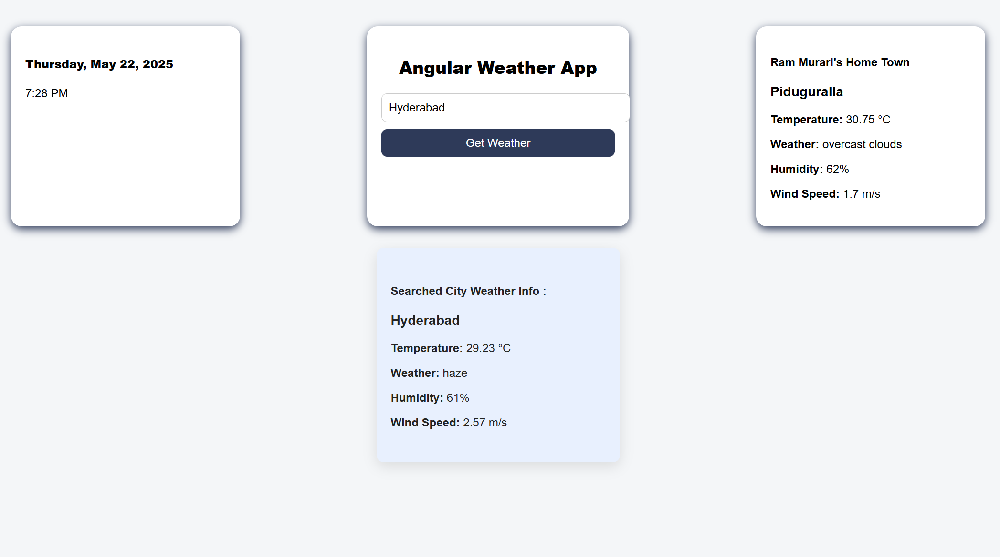

# WeatherAppAngular 🌦️

WeatherAppAngular is a responsive Angular application that fetches and displays real-time weather information for any city using the OpenWeatherMap API. It also shows default weather information for **Piduguralla**, your hometown, on the right side, and current date & time on the left.

---

## 🔥 Features

- Live weather search by city name
- Auto-display of Piduguralla weather
- Current date and time display
- Responsive and modern UI
- Shows temperature, weather description, humidity, and wind speed

---

## 🚀 Getting Started

Follow these steps to set up the project locally.

### 1. Clone the Repository

```bash
git clone https://github.com/murariram2905/weatherAppAngular.git
cd weatherAppAngular
2. Install Dependencies
bash
Copy
Edit
npm install
3. Set Up OpenWeatherMap API Key
Sign up at https://openweathermap.org and get your API key

Add your API key to the service file weather.service.ts:

typescript
Copy
Edit
private apiKey = 'YOUR_API_KEY'; // <-- Replace this with your actual key
(Optional) You can also store it in environment.ts for better practice.

💻 Run the Application
bash
Copy
Edit
ng serve
Open your browser and go to: http://localhost:4200

Search for a city name to view its weather

Piduguralla's weather is always shown on the right

Current date and time shown on the left

🧰 Technologies Used
Angular 16+

TypeScript

SCSS

Bootstrap (for layout/styling)

OpenWeatherMap API

🖼️ Screenshots (Optional)
Add screenshots here if needed using:



Fork the repo

Create a branch: git checkout -b feature/your-feature

Commit your changes: git commit -m 'Add feature'

Push to the branch: git push origin feature/your-feature

Open a pull request

📄 License
This project is licensed under the MIT License - see the LICENSE file for details.

📬 Contact
Built by Murariram2905
GitHub: @murariram2905
